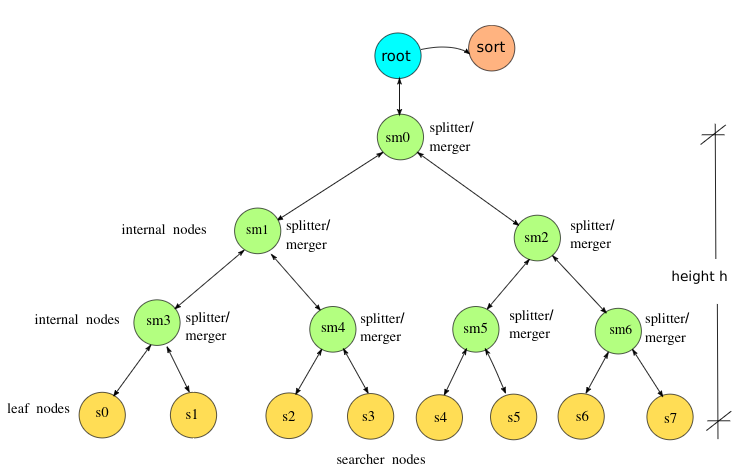

# Search strings or substrings in binary file using forked children #
### The program forks in each level two processes that can be visualized as a tree : <br>

            
## Types of processes that will be forked: ##
**Searcher :** <br> 
Receives as parameters the name of the file, the range of records to search in and the string it searches for. Returns results and running time to parent process through pipe. <br>
**Splitter/Merger :** <br>
Receives as parameters the name of the file, the range of records to keep splitting, the string to be searched and the remaining height of the tree. If height>1 splitter/merger forks two other splitter/mergers passing half the range as argument. If height=1 splitter/merger forks two searcher processes passing half the range as argument. When searchers pass their results and running times to splitter/merger, the latter returns that info to its parent through pipe along with its running time. <br>
**Root :** <br>
Forks first splitter/merger process. After all splitter/merger processes and searchers have finished and returned their results and running times to root, root calculates and prints statistics based on running times and forks a sort process (unix sort command) to sort returned records and print them. <br>


**Input :** <br>
Run the program as:
```
./myfind -h height -d datafile -p pattern -s
```
where : <br>
**height** is the height of the binary search tree to be created. Maximum allowed height is 5. E.g. height=3 means one splitter-merger two splitter-merger children each, with two searchers each. Every searcher will search in 1/4 of the file. <br>
**datafile** is the binary file to search in for a string. You can use the files in test_files folder. <br>
**pattern** is the string or substring to be searched in the file. <br><br>
**-s** means skew and it is **optional**. If this flag is given as a command line argument then splitter/merger will split records in a skew way, specifically if k is the total number of records in the file and h is the height of the tree, then the ith searcher will search in a range of k*i / Sum(from 1 to 2^h) <br>

## File Format ##
Files are binaries that have records with this structure: <br>
id, first name, last name, street, house number, city, postal code, salary (without commas) 

## Example ##
```
$ ./myfind -h 4 -d test_files/Records100.bin
14196011 Bunn Vasilis  Fitzpatrick 160 Mechanicsville 31609 315.00   
14713949 Scafidi Victor  Cooper 367 Mechanicsville 40233 911.00   
14824935 Wilkins Anastasia  Meadows 293 Bakersville 45385 1253.00  
15409051 Linard Barry  Mackenzie 377 Edesville 31497 914.00   
15657389 Haynes Eva  Mangnall 330 Edesville 32729 991.00   
15964028 Rosenthal Mikhos  Goodwin 208 Powellville 21529 1044.00  
16023453 Gianakos Lori  Whitehouse 176 Corriganville 37769 725.00   
16095630 Philippidis Allan  Mcneill 154 Danville 25561 1114.00  
16143105 Deal Hazel  Crouch 270 Ernstville 31945 860.00   
16316746 Beatty Ianthe  Abbott 142 Stevensville 13353 402.00   
16988030 Prince Kristine  Mccormack 416 Clarysville 20521 398.00   
17350069 Meyers Laura  Holloway 171 Catonsville 21305 1184.00  
17719197 Schaefer Florence  Stewart 280 Bartonsville 15481 312.00   
18169417 Horne Teresa  Bates 439 Clarysville 17273 875.00   
18373711 Musto Courtney  Sheppard 349 Bartonsville 13353 1256.00  
18491660 Humphrey Edgar  Silva 151 Grasonville 29481 1137.00  
18941180 Thompson Dion  Wilkinson 414 Jesterville 12457 1075.00  

17 records found
Root received 16 SIGUSR2 signals
Min searcher running time: 0.000091
Max searcher running time: 0.000303
Average searcher running time: 0.000115
Min splitter/merger running time: 0.000824
Max splitter/merger running time: 0.019470
Average splitter/merger running time: 0.003760
Turnaround Time 0.022926
```
